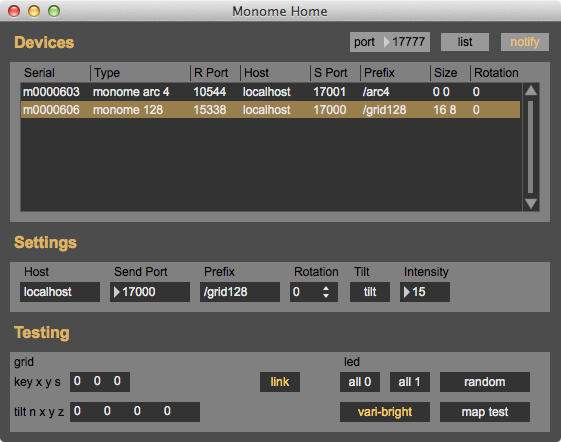

# [Monome Home](https://github.com/monome-community/Monome-Home)

monome home collects information about all of the serialosc devices currently connected to your computer and displays it in a simple device list.

you can click on one of the displayed devices to select it and allow editing of its serialosc settings i.e host, port, prefix, rotation, tilt.

also provided is a simple testing section to check key presses and encoder deltas, and to test grid and ring leds.

requires serialosc 1.2 or above and max 6 or above. (zeroconf/bonjour is not used, so you do not need the externals installed in max) 